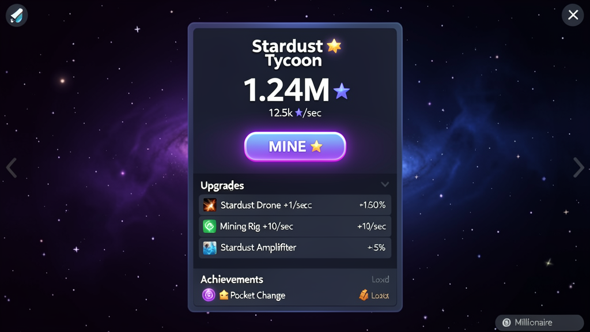

# Stardust Tycoon ✨


An idle/clicker game where numbers go up forever — mine stardust, automate galaxies, and prestige for permanent power.

▶️ **[Play it now](https://noah-simons.github.io/Stardust-Tycoon/)** — runs in your browser, no install.



## Features

- ⛏️ **Click mining** — tap to earn stardust, with a satisfying pop and floating "+N". Press **Space** or **Enter** to mine hands-free too.
- 🤖 **17 upgrades** across three tracks: auto-miners (Drone → Singularity), click-power tiers (Fingers → Mecha Fingers), and production multipliers (Amplifiers).
- 🔁 **Prestige system** — reset at 10M ✦ for a permanent +10% production bonus per reset.
- 🏆 **10 achievements** — milestone rewards that pay out bonus stardust.
- 💤 **Offline progress** — earn up to 8 hours of production while you're away.
- 💾 **Autosave** to `localStorage` (no account needed).
- 🛒 **Batch buying** — buy x1 / x10 / x100 / Max in one click.
- 🔊 **Sound effects** generated live with the Web Audio API — no audio files to download.

## Run it locally

```bash
git clone https://github.com/Noah-Simons/Stardust-Tycoon.git
cd Stardust-Tycoon
python3 -m http.server 8000
```

Then open **http://localhost:8000** in your browser.

> **Why not just double-click `index.html`?** Opening it as a `file://` URL makes the browser block some features (like certain script/module behavior and storage quirks). Running a tiny local server avoids that. Any static server works (`python3 -m http.server`, `npx serve`, etc.) — there is no build step and no dependencies.

## How it works

Almost all of the game's content lives in two arrays at the top of [`game.js`](game.js): **`UPGRADES`** and **`ACHIEVEMENTS`**.

- `UPGRADES` — each entry is one buyable thing: its name, description, base cost, and effect (`cps` for per-second production, `clickAdd` for per-click, or `mult` for a % production bonus).
- `ACHIEVEMENTS` — each entry has a `cond(state)` function and a one-time `reward`.

**The single most useful thing for a new contributor:** to add new content, you usually just add one object to one of those two arrays — no other wiring required. The render loop, shop, and achievement checker all read from them automatically.

## Contributing

Contributions are welcome! Please read [CONTRIBUTING.md](CONTRIBUTING.md) first. Good places to start are issues tagged [**good first issue**](https://github.com/Noah-Simons/Stardust-Tycoon/issues?q=label%3A%22good+first+issue%22).

## Roadmap

See the [open issues](https://github.com/Noah-Simons/Stardust-Tycoon/issues) for planned work — balance fixes, a closed-form Max-buy formula, big-number support, and more.

## Cloud saves

Sign in with Google to sync your save across devices. It's **optional** — the game is fully playable signed out, and your progress is saved in your browser either way.

When two devices disagree, the save with the higher lifetime **total mined** wins, and you're always asked before anything is overwritten.

## Privacy

If you sign in, this game stores your Google account ID, display name, and your save data (stardust, upgrades, prestige, achievements) in Google Firebase. Nothing else, and it's never shared or sold.

This site also uses **Google Analytics**, which collects anonymous usage data (page views, approximate location, browser and device type) from **all visitors**, whether signed in or not.

To delete your cloud save, sign in and hit **Reset save**, then sign out — or open an issue and I'll remove it.

## License

[MIT](LICENSE) © 2026 Noah Simons.
